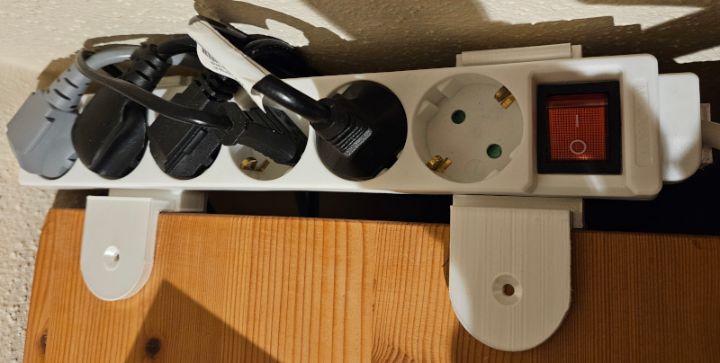
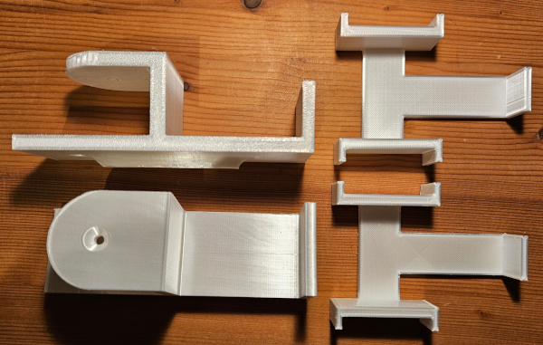
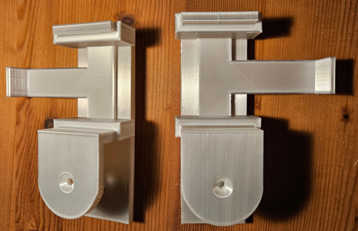

# PowerStripHolder
A 3D-printed mount for a power strip to attach to the edge of a table.

| Property  | Value |
| ------------- | ------------- |
| Tabletop height | 28mm |
| Powerstrip width | 46mm |
| 3D print weight | 105g |

## License and copyright
My [3d STL print files](#STL) are licensed under the terms of CC0 [Copyright (c) 2025 codingABI](LICENSE). 

## Appendix

### STL

- [Holder](STL/PowerStripHolder.stl) (Two prints are needed)
- [Insert](STL/PowerStripInsert.stl) (Two prints are needed)

All STL files were created and designed with Tinkercad https://www.tinkercad.com

Printer settings used on my Anycubic Vyper (Thank you **https://github.com/m-holler**!): 
- Nozzle: 0.4mm
- Layer height: 0.15mm
- Filament: PLA+ silk
- Sparse infill density: 25% (For the [Holder](STL/PowerStripHolder.stl). For the [Insert](STL/PowerStripInsert.stl) the default value 15% was used)
- Raft layers: 1 layer (Optional, for the [Insert](STL/PowerStripInsert.stl) to prevent warping)